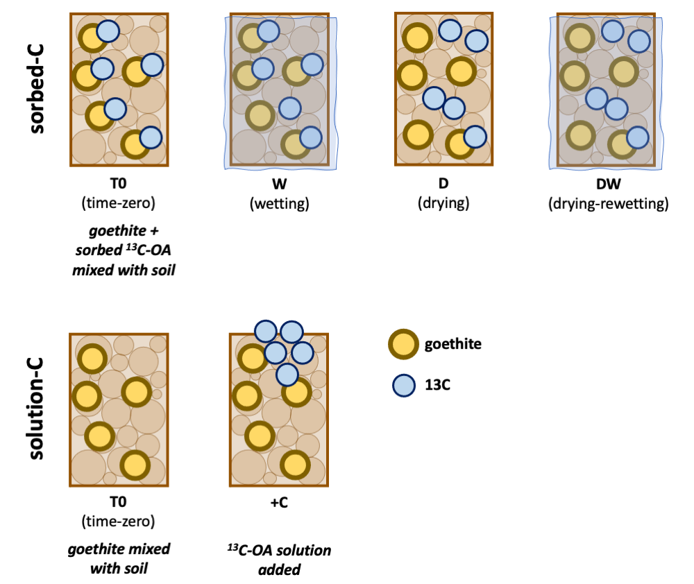

```{r setup, include=FALSE}
knitr::opts_chunk$set(echo = FALSE,
                      message = FALSE,
                      warning = FALSE)
```

```{css, echo = FALSE}
.remark-slide-content {
  font-size: 20px;
  padding: 20px 80px 20px 80px;
}

.smalltext {font-size: 80%}

.remark-code, .remark-inline-code {
  background: #f0f0f0;
}
.remark-code {
  font-size: 24px;
}
.huge .remark-code { /*Change made here*/
  font-size: 200% !important;
}
.small .remark-code { /*Change made here*/
  font-size: 50% !important;
}
```

### Objectives

To partition biochemical and physicochemical protection/destabilization mechanisms for soil C by their sensitivities to wetting and drying.

### Hypotheses

1. drying and wetting processes destabilize C via different mechanisms: desorption and cell lysis (drying), vs. increased hydrologic connectivity and improved spatial access to substrate (wetting). 
  - under conditions of drying, desorption of C from clay-sorbed substrate will result in [lag and release] of desorption/respiration. vs. cell lysis means we will have a pulse of more 12C vs. the newly added 13C
1. drying will have a stronger effect on soil C destabilization, compared to wetting
  - drying will have a higher ratio of 13/12C because the respiration will be more destabilization vs. wetting/access to native soil C. 


---
### Experiment
.smalltext[
60 g field-moist Palouse soil (~58 g oven-dry equivalent) in pint size Mason jars  
labelled substrate (13C-oxalic acid, 18.66 % enriched) was added to the soil, in adsorbed or solution form.  
]

.pull-left[

]


.pull-right[

**adsorbed-C**:  
- 20 mL of labelled OA solution mixed with 5 g goethite; rinsed 3x; labelled goethite resuspended in 5 mL water; added as paste to soil units

- The soil was subjected to one of the following treatments, after which the jars were sealed:
  1. time-zero: jars sealed as soon as goethite was added
  1. wetting: 20 mL water added
  1. drying: soil allowed to air-dry until constant weight
  1. drying-rewetting: soil allowed to dry, then rewet with 20 mL water
  
- The jars were sealed for 48 hours.


]

---

### Experiment
.smalltext[
60 g field-moist Palouse soil (~58 g oven-dry equivalent) in pint size Mason jars  
labelled substrate (13C-oxalic acid, 18.66 % enriched) was added to the soil, in adsorbed or solution form.  
]

.pull-left[

]


.pull-right[

**solution-C**:  
- a parallel experiment was performed as a control for priming effects of the added OA
- 5 g goethite mixed with soil; 16 mL of labelled OA solution added to the soil-goethite mixture

- The soil was subjected to one of the following treatments, after which the jars were sealed:
  1. time-zero: goethite mixed with soil
  1. wetting: 16 mL 13C-OA solution added

- The jars were sealed for 48 hours.
]

---

### Analyses

1. **respiration**: headspace samples were collected after the 48-hr incubation. analyzed for CO2 and 13C-CO2
  - LI-7810 (LI-COR), LGR

1. **WEOC** (water extractable organic C): organic carbon extracted and analyzed for C content and 13C
  - extracts were dried to powder and analyzed as solid samples 
  - VarioIsotope Cube/Isoprime precisION IRMS (Elementar) 

1. **total soil C**: soil was dried and analyzed for C and 13C content
  - VarioIsotope Cube/Isoprime precisION IRMS (Elementar) 

---

### sorbed-C

.pull-left[
```{r}
readd(gg_desorption)
```
]

.pull-right[
.smalltext[
**Figure Caption**

C concentrations and d13C values (relative to Vienna Pee Dee Belemnite) for T0 (time-zero), W (wetting), D (drying), and DW (drying-rewetting) treatments.

Different letters denote significant differences across treatments. 

Asterisks denote significant differences from the unlabelled control samples (dashed line).
]
]

---

### sorbed-C

.pull-left[
```{r}
readd(gg_desorption)
```
]

.pull-right[
**respiration**

- C amendment did not increase respiration
- however, the CO2 evolved was significantly enriched throughout (except for D, which had almost no respiration)
  - thus, the added OA did contribute to the CO2 evolved, but did not increase overall CO2 evolved
  - respiration in these soils is not C limited?
  - no priming effect?
  - perhaps low microbial load, so low respiration potential

  - *even adding oxalic acid in solution form did not increase CO2 significantly, see solution-C slides*

]

---
### sorbed-C

.pull-left[
```{r}
readd(gg_desorption)
```
]

.pull-right[
**respiration**

- simply mixing the labelled clay with the soil did not change the amount of CO2 evolved (T0).
- wetting decreased the evolved CO2 by 0.05 mg C/g.
  - negative priming as the oxalic acid was released?
  - high moisture suppressed respiration?
  - lag effect?
  
]

---

### sorbed-C

.pull-left[
```{r}
readd(gg_desorption)
```
]

.pull-right[
**respiration**

- CO2 enrichment did not differ between W and DW samples.
  - *we expected DW > W*
  - W and DW mobilized C equally? 
  
- but more CO2 was evolved after DW, compared to W
  - drought effects: destabilization of C, microbial necromass/osmolytes

]

---

### sorbed-C

.pull-left[
```{r}
readd(gg_desorption)
```
]

.pull-right[

**WEOC**

- WEOC concentrations were lower than control for all except D
  - because the C was consumed for respiration? (*inconsistent with resp data*)

- D had the greatest WEOC concentrations
  - (a) desorption of C, (b) microbial necromass/osmolytes, and/or (c) C was not respired and therefore accumulated

]

---

### sorbed-C

.pull-left[
```{r}
readd(gg_desorption)
```
]

.pull-right[

**WEOC**

- WEOC was enriched throughout

- W and D were the most enriched
  - because both wetting and drying processes destabilized C

- note: W and D had similar enrichment, but W had lower WEOC concentrations. So less 13C was destabilized by wetting?
  - also: mass balance slide shows T0 and W had similar 13C, and D had increased 13C. So drying destabilized more C than W?
]

---

### sorbed-C

.pull-left[
```{r}
readd(gg_desorption)
```
]

.pull-right[

**WEOC**

- W had greater variability than D (STATS)
  - preferential wetting patterns? 
  - "weaker/non-uniform destabilization" than drying? 
]

---


### sorbed-C

.pull-left[
```{r}
readd(gg_desorption)
```
]

.pull-right[

**soil C**

- soil C concentrations were lower than control for all
  - because the C was consumed for respiration? (*inconsistent with resp data*)

- soil C was enriched for all,

- with greatest enrichment in D
  - ???
  - accumulation of unrespired C?
  - but D also had the lowest C concentrations (non-sig), and 13C ug/g was similar to T0 (see mass balance slide)
]

---
### solution-C

.pull-left[
```{r}
readd(gg_priming)
```
]


.pull-right[
.smalltext[
T0 = goethite mixed with soil

+C = 13C-OA added in solution form

]


- respiration, WEOC, and soil were all enriched after addition of soluble 13C-oxalic acid
- CHECK T0 ENRICHMENT STATS

- respiration: more enriched from solution-C (1648 ‰) compared to sorbed-C (586 ‰) 
  - OA was more available in solution form than in adsorbed form
  
- but despite increased OA contribution, overall CO2 evolved did not increase.
]

---

### Mass Balance: sorbed-C

.pull-left[
```{r, fig.height=5}
readd(gg_mass_balance)$gg_massbalance_desorp
```
]

.pull-right[
493 μg (`r round(493/63.9,2)` μg/g) 13C was added in sorbed form.

13C μg/g in sorbed-C soils compared to control soils:

|   | resp   |  soil  |  weoc  |
|---|--------|--------|--------|
|T0 | +0.716 | -34.1  | -0.291 |
|W  | +0.205 | -15.6  | -0.204 |
|D  |  NA †  |  NA †  |  NA †  |
|DW | +0.490 | -11.3  | -0.520 |

† no control samples

]
---
### Mass Balance: sorbed-C

.pull-left[
```{r, fig.height=5}
readd(gg_mass_balance)$gg_massbalance_desorp
```
]

.pull-right[
**isotope retention**

493 μg (`r round(493/63.9,2)` μg/g) 13C was added in sorbed form.

But the treated soils showed decreased 13C values. (???)

comparing added 13C with (resp + soil) difference, there is a missing piece of 13C
  - methane? no, because CH4 production was very, very low, and did not change with treatment/OA addition.

]
---
### Mass Balance: solution-C

.pull-left[
```{r, fig.height=5, fig.width=5}
readd(gg_mass_balance)$gg_massbalance_priming
```
]


.pull-right[
417 ug (`r round(417/63.8,2)` ug/g) 13C was added as solution

  - very little change in WEOC-13C
  - some increase in resp-13C
  - decrease in soil-13C  
**SO WHERE DID THE 13C GO???**
  

13C μg/g in +C compared to T0 (time zero):

|   | resp   |  soil  |  weoc  |
|---|--------|--------|--------|
|+C | +1.82  | -8     | +0.08  |

]

---

### extra: How did clay addition influence C?

.pull-left[
```{r}
readd(gg_tzero)
```
]

.pull-right[
We compare time-zero of control (soil only) with time-zero of solution-C treatment (soil + goethite)

- respiration did not change significantly, but enrichment was more variable
  - ???
  
- weoc decreased, but enrichment did not change
  - previously available sorbed onto goethite

- soil C decreased, as did enrichment
  - ???
  
]

---


### Conclusions

- wetting did not destabilize much sorbed-C

- drying released more sorbed-C than wetting


---

## MAJOR QUESTIONS

1. do we use δ13C or C13 mass (mass balance) to determine extent of destabilization?

2. missing 13C?

---

### Session Info 

Date run: `r Sys.Date()`

Slides prepared using [xaringan](https://github.com/yihui/xaringan)


.small[
```{r}
utils:::print.sessionInfo(sessionInfo()[-8])
```
]


