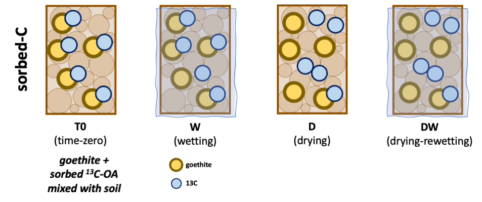
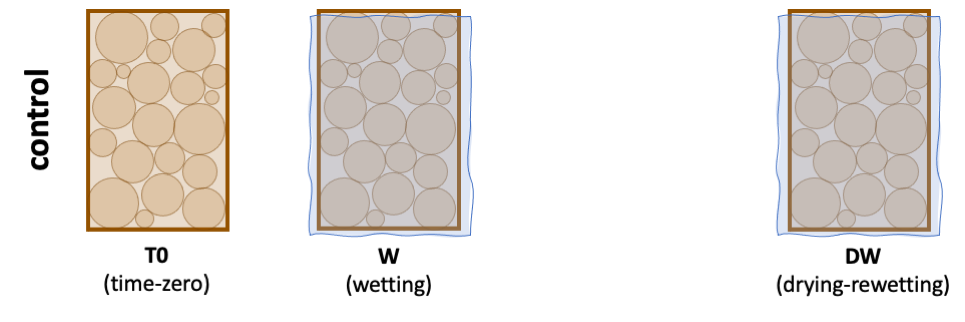
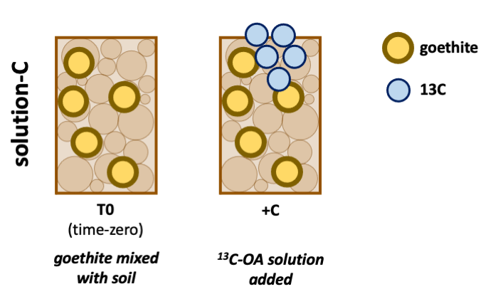

```{r setup, include=FALSE}
knitr::opts_chunk$set(echo = FALSE,
                      message = FALSE,
                      warning = FALSE)
```

```{css, echo = FALSE}
.remark-slide-content {
  font-size: 20px;
  padding: 20px 80px 20px 80px;
}

.smalltext {font-size: 80%}

.remark-code, .remark-inline-code {
  background: #f0f0f0;
}
.remark-code {
  font-size: 24px;
}
.huge .remark-code { /*Change made here*/
  font-size: 200% !important;
}
.small .remark-code { /*Change made here*/
  font-size: 50% !important;
}
```

### Objectives

To partition biochemical and physicochemical protection/destabilization mechanisms for soil C by their sensitivities to wetting and drying.

### Hypotheses

1. drying will have a stronger effect on soil C destabilization, compared to wetting


---
### Experiment
.smalltext[

]

.pull-left[

  
13C-labelled organic substrate was adsorbed onto clay and added to soil

]

.pull-right[

**SOIL USED**
- Palouse soil  

  - Fine-silty, mixed, superactive, mesic Pachic Ultic Haploxerolls
  - 2.61 % w/w gravimetric moisture
  - 3.17 % carbon
  - 13C at% 1.08 (R = 1.09 %, δ13C = -26.9 ‰)

- the soils were sieved through 4 mm and homogenized
- stored at 4 °C until ready
- 60 g field-moist soil (~58 g oven-dry equivalent) was weighed into pint size Mason jars 
- 5 mL deionized milli-Q water was added to each jar, and then the soils were held at 21 °C for 24 hours before the experiment began (conditioning)
]

---

### Experiment
.pull-left[

]


.pull-right[
**PREPARING SUBSTRATE + CLAY**
- labelled substrate (13C-oxalic acid) was added to the soil, adsorbed onto goethite
   - labelled and unlabelled OA were mixed to prepare a solution of 150 mgC/L with at% = 16.02 (R = 19.08 %, δ13C = 15,975 ‰)
   - 20 mL of this solution was mixed with 5 g goethite
   - the goethite was rinsed with DI water 2x
   - 5 mL DI water was added to the rinsed goethite to form a paste
   - this paste of goethite + OA was added to each Mason jar
   - the final prepared goethite contained 0.25 % carbon with at% 3.94 (R = 4.10 %, δ13C = 2644.38 ‰)
]

---

### Experiment - Treatments

.pull-left[

]

.pull-right[
- The soil was subjected to one of the following treatments, after which the jars were sealed:
  1. time-zero: jars sealed as soon as goethite was added
  1. wetting: 20 mL water added
  1. drying: soil allowed to air-dry until constant weight
  1. drying-rewetting: soil allowed to dry, then rewet with 20 mL water
  
- The jars were sealed for 48 hours.
]

---
### Experiment - Controls

.pull-left[

]

.pull-right[
**CONTROL**
- A set of controls was analyzed by subjecting soils to the same treatments, but without the added goethite + OA

  - time-zero: jars sealed as soon as goethite was added
  - wetting: 20 mL water added
  - drying-rewetting: soil allowed to dry, then rewet with 20 mL water
  
- The jars were sealed for 48 hours.
]

---
### Experiment - Controls

.pull-left[

]

.pull-right[
**CONTROL FOR PRIMING: solution-C added**
- We had another set of controls to test for priming effects due to the added substrate. labelled substrate was added as a solution
  - 5 g goethite was mixed with the soil, 
  - and then 16 mL of the 19.08 % enriched OA solution was added to the soil 

- these soils were subjected to only the first two treatments
  - time-zero: jars sealed as soon as goethite was added
  - +C: 16 mL labelled OA solution added

- The jars were sealed for 48 hours.
]

---

### Analyses

1. **respiration**: headspace samples were collected after the 48-hr incubation. analyzed for CO2 and 13C-CO2
  - LI-7810 (LI-COR), LGR

1. **WEOC** (water extractable organic C): organic carbon extracted and analyzed for C content and 13C
  - extracts were dried to powder and analyzed as solid samples 
  - VarioIsotope Cube/Isoprime precisION IRMS (Elementar) 

1. **total soil C**: soil was dried and analyzed for C and 13C content
  - VarioIsotope Cube/Isoprime precisION IRMS (Elementar) 

---

### RESULTS (sorbed-C)

.pull-left[
```{r, fig.width=10}
readd(gg_desorption)
```
]

.pull-right[
.smalltext[
**Figure Caption**

total C concentrations, δ13C, and 13C concentrations for T0 (time-zero), W (wetting), D (drying), and DW (drying-rewetting) treatments.

Different letters denote significant differences across treatments. 

Asterisks denote significant differences from the unlabelled control samples (dashed line).
]
]

---

### RESULTS (sorbed-C)

.pull-left[
```{r, fig.width=10}
readd(gg_desorption)
```
]

.pull-right[
**respiration**

- C amendment did not increase respiration

- in fact, wetting decreased the evolved CO2 by 0.05 mg C/g compared to time-zero
  - negative priming as the oxalic acid was released?
  - high moisture suppressed respiration?
  - lag effect?

- air-dry (D) soils had minimal respiration (as expected)
]

---
### RESULTS (sorbed-C)

.pull-left[
```{r, fig.width=10}
readd(gg_desorption)
```
]

.pull-right[
**respiration**

- T-zero, W, and DW soils showed increased 13C enrichment (δ13C) compared to the control soils
  - suggesting that some of the labelled sorbed C was desorbed and mineralized

- however, when comparing μg/g of 13C-CO2, only T0 and DW were significantly greater than the controls
  - because total CO2-C decreased in W

- thus, the added OA did contribute to the CO2 evolved, but did not increase overall CO2 evolved
  - respiration in these soils is not C limited?
  - no priming effect?
  - ~~perhaps maximum respiration potential was achieved?~~


]

---

### RESULTS (sorbed-C)

.pull-left[
```{r, fig.width=10}
readd(gg_desorption)
```
]

.pull-right[
**respiration**

- the enrichment/amount of 13C-CO2 released from the goethite did not differ between T0/W and DW samples.
  - *we expected DW > W*
  - W and DW mobilized C equally? 
  
- additionally, W samples showed greater variability than DW samples [STATS NEEDED]
  - preferential wetting patterns? 
  - "weaker/non-uniform destabilization" than drying? 

]

---

### RESULTS (sorbed-C)

.pull-left[
```{r, fig.width=10}
readd(gg_desorption)
```
]

.pull-right[

**WEOC**

- WEOC concentrations were lower than control for all except D
  - because the C was consumed for respiration? (*inconsistent with resp data*)

- D had the greatest WEOC concentrations
  - (a) desorption of C, (b) microbial necromass/osmolytes, and/or (c) C was not respired and therefore accumulated

]

---

### RESULTS (sorbed-C)

.pull-left[
```{r, fig.width=10}
readd(gg_desorption)
```
]

.pull-right[

**WEOC**

- WEOC was enriched throughout (δ13C) 
- W and D were the most enriched (δ13C)
  - suggesting that both wetting and drying caused destabilization of the adsorbed 13C
  
- however, μg/g 13C was lower than the controls (because total C was also lower than controls) 

- air-dry (D) soils had the greatest WEOC-13C
  - because the adsorbed C was destabilized, but not mineralized. 
  - When these dry soils were rewet (DW), this available C was mineralized. 
]

---


### RESULTS (sorbed-C)

.pull-left[
```{r, fig.width=10}
readd(gg_desorption)
```
]

.pull-right[

**WEOC**

- W δ13C also had greater variability than D/DW (STATS NEEDED)
  - preferential wetting patterns? 
  - "weaker/non-uniform destabilization" than drying? 
]

---


### RESULTS (sorbed-C)

.pull-left[
```{r, fig.width=10}
readd(gg_desorption)
```
]

.pull-right[

**soil C**

- soil C concentrations were lower than control for all
  - because the C was consumed for respiration? (*inconsistent with resp data*)

- soil C was enriched for all,

- with greatest enrichment in D
  - ???
  - accumulation of unrespired C?

- however, δ13C did not differ among treatments, and was significantly lower than in control soils
  - ???
]

---
### solution-C (control for priming)

.pull-left[
```{r, fig.width=10}
readd(gg_priming)
```
.smalltext[
T0 = goethite mixed with soil

+C = 13C-OA added in solution form

]
]


.pull-right[


- respiration, WEOC, and soil were all enriched after addition of soluble 13C-oxalic acid

- respiration: more enriched from solution-C (1648 ‰) compared to sorbed-C (586 ‰) 
  - OA was more available in solution form than in adsorbed form
  
- but despite increased OA contribution, overall CO2-C evolved (mg/g) did not increase.
]

---

### Mass Balance

.pull-left[
```{r, fig.height=5}
readd(gg_mass_balance)$gg_massbalance_desorp
```
]

.pull-right[
**SORBED-C**
- these graphs show C13 (μg/g) in respiration and WEOC fractions for control and sorbed-C samples. 

- total C13 in soils was 2 orders of magnitude greater and is not plotted here, but included as text annotation for the respective treatments

]
---
### Mass Balance

.pull-left[
```{r, fig.height=5}
readd(gg_mass_balance)$gg_massbalance_desorp
```
]

.pull-right[
**SORBED-C**
- 493 μg (`r round(493/63.9,2)` μg/g) 13C was added in sorbed form. can we account for all the 13C added?

- compared to the control soils, the treated soils showed increased C13 (μg/g) in respiration, but decreased C13 in WEOC and total soil:

|   | resp     |  soil   |  weoc    |
|---|----------|---------|----------|
|T0 | +0.716 * | -34.1 * | -0.291 * |
|W  | +0.205   | -15.6 * | -0.204 * |
|D  |  NA †    |  NA †   |  NA †    |
|DW | +0.490 * | -11.3 * | -0.520 * |

† no control samples for comparison  
asterisk = significant difference from control
]
---
### Mass Balance

.pull-left[
```{r, fig.height=5}
readd(gg_mass_balance)$gg_massbalance_desorp
```
]

.pull-right[
**SORBED-C: isotope retention**

- 493 μg (`r round(493/63.9,2)` μg/g) 13C was added in sorbed form. 

- but there was a net decrease of 13C in the treated soils, comparing 13C added with (resp + soil)

- is there a missing piece?
  - methane? no, because CH4 production was very, very low, and did not change with treatment/OA addition.
  - spatial variability? power analysis indicated that minimum detectable change in soil was 12.00 μg/g.

]
---
### Mass Balance: solution-C

.pull-left[
```{r, fig.height=5, fig.width=5}
readd(gg_mass_balance)$gg_massbalance_priming
```
]


.pull-right[
384 μg (`r round(384/63.8,2)` μg/g) 13C was added as solution

- compared to T0, the +C soils showed:
  - small but significant increase in WEOC-13C
  - small but significant increase in resp-13C
  - no significant change in soil-13C  
**SO WHERE DID THE 13C GO???**

|   | resp    |  soil  |  weoc   |
|---|---------|--------|---------|
|+C | +1.82 * | -8     | +0.08 * |

- spatial variability of soil?
  - power analysis of T0 vs. +C soil data indicated a minimum detectable change of 22.89 μg/g C13
  

]

---

### extra: How did clay addition influence C?

.pull-left[
```{r}
readd(gg_tzero)
```
]

.pull-right[
We compare time-zero of control (soil only) with time-zero of solution-C treatment (soil + goethite)

- respiration did not change significantly, but enrichment was more variable
  - ???
  
- weoc decreased, but enrichment did not change
  - previously available SOM was now sorbed onto goethite

- soil C decreased, as did enrichment
  - ???
  
]

---


### Conclusions

*coming soon*

---

### Session Info 

Date run: `r Sys.Date()`

Slides prepared in RMarkdown using [xaringan](https://github.com/yihui/xaringan)


.small[
```{r}
utils:::print.sessionInfo(sessionInfo()[-8])
```
]

