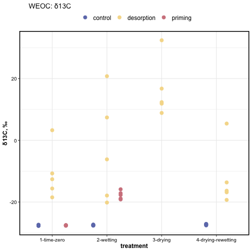
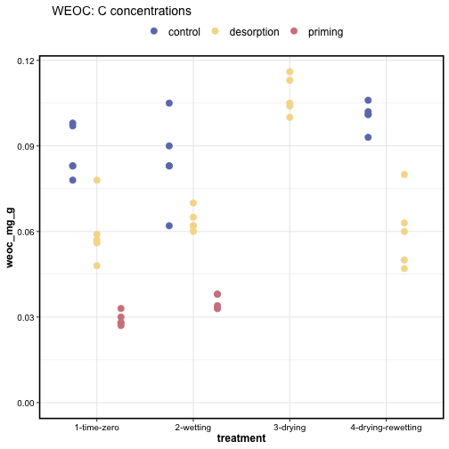
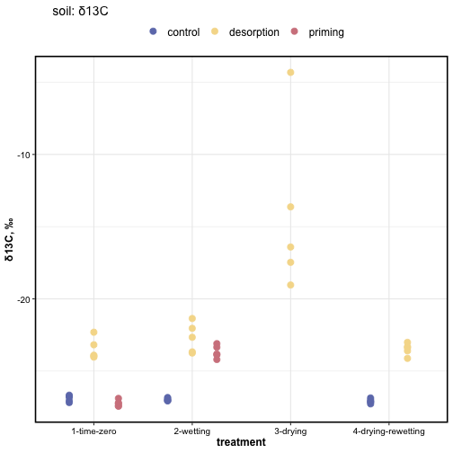
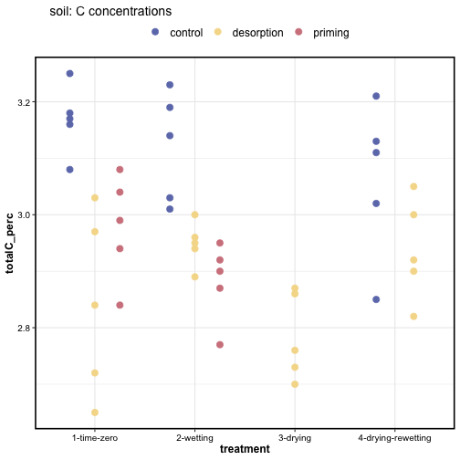
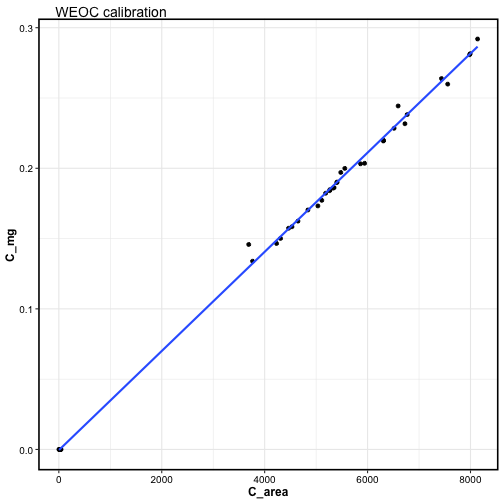
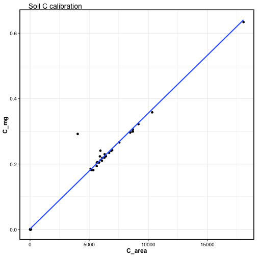

a 

---

## Water extractable organic carbon (WEOC)


```
#> $gg_weoc_d13C
```



```
#> 
#> $gg_weoc_tc
```



## Soil total carbon 


```
#> $gg_soil_d13C
```



```
#> 
#> $gg_soil_tc
```




---

## Albus (Total C) calibration




---

<details>   
   <summary>Session Info</summary>
   
Date run: `Sys.Date()`


```
#> R version 4.0.2 (2020-06-22)
#> Platform: x86_64-apple-darwin17.0 (64-bit)
#> Running under: macOS Catalina 10.15.7
#> 
#> Matrix products: default
#> BLAS:   /System/Library/Frameworks/Accelerate.framework/Versions/A/Frameworks/vecLib.framework/Versions/A/libBLAS.dylib
#> LAPACK: /Library/Frameworks/R.framework/Versions/4.0/Resources/lib/libRlapack.dylib
#> 
#> locale:
#> [1] en_US.UTF-8/en_US.UTF-8/en_US.UTF-8/C/en_US.UTF-8/en_US.UTF-8
#> 
#> attached base packages:
#> [1] stats     graphics  grDevices utils     datasets  methods   base     
#> 
#> other attached packages:
#>  [1] ezknitr_0.6     PNWColors_0.1.0 drake_7.12.4    forcats_0.5.0   stringr_1.4.0  
#>  [6] dplyr_1.0.1     purrr_0.3.4     readr_1.3.1     tidyr_1.1.1     tibble_3.0.3   
#> [11] ggplot2_3.3.2   tidyverse_1.3.0
#> 
#> loaded via a namespace (and not attached):
#>  [1] httr_1.4.2        jsonlite_1.7.0    splines_4.0.2     R.utils_2.9.2     here_0.1         
#>  [6] modelr_0.1.8      assertthat_0.2.1  highr_0.8         base64url_1.4     blob_1.2.1       
#> [11] cellranger_1.1.0  yaml_2.2.1        progress_1.2.2    pillar_1.4.6      backports_1.1.8  
#> [16] lattice_0.20-41   glue_1.4.1        digest_0.6.25     rvest_0.3.6       colorspace_1.4-1 
#> [21] htmltools_0.5.0   Matrix_1.2-18     R.oo_1.23.0       pkgconfig_2.0.3   broom_0.7.0      
#> [26] haven_2.3.1       scales_1.1.1      mgcv_1.8-31       txtq_0.2.3        generics_0.0.2   
#> [31] farver_2.0.3      ellipsis_0.3.1    withr_2.2.0       cli_2.0.2         magrittr_1.5     
#> [36] crayon_1.3.4      readxl_1.3.1      evaluate_0.14     storr_1.2.1       R.methodsS3_1.8.0
#> [41] fs_1.5.0          fansi_0.4.1       nlme_3.1-148      xml2_1.3.2        rsconnect_0.8.16 
#> [46] tools_4.0.2       prettyunits_1.1.1 hms_0.5.3         lifecycle_0.2.0   munsell_0.5.0    
#> [51] reprex_0.3.0      packrat_0.5.0     compiler_4.0.2    rlang_0.4.7       grid_4.0.2       
#> [56] rstudioapi_0.11   igraph_1.2.5      labeling_0.3      rmarkdown_2.3     gtable_0.3.0     
#> [61] DBI_1.1.0         R6_2.4.1          lubridate_1.7.9   knitr_1.29        filelock_1.0.2   
#> [66] rprojroot_1.3-2   stringi_1.4.6     parallel_4.0.2    Rcpp_1.0.5        vctrs_0.3.2      
#> [71] dbplyr_1.4.4      tidyselect_1.1.0  xfun_0.16
```

</details>   
