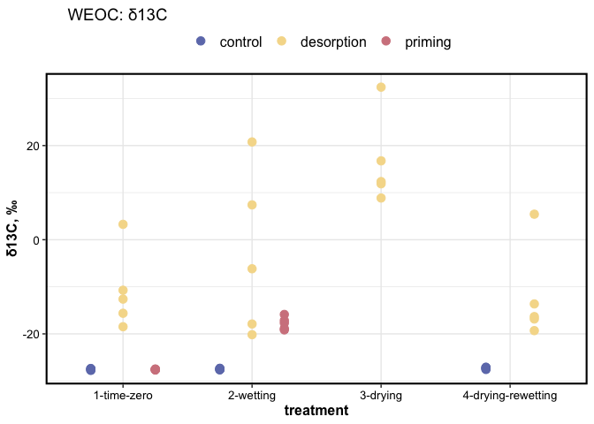
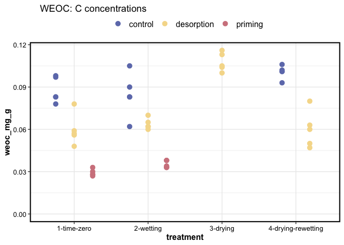
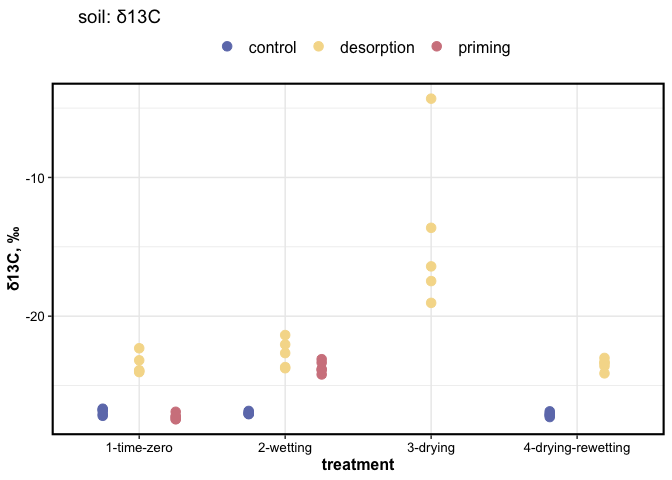
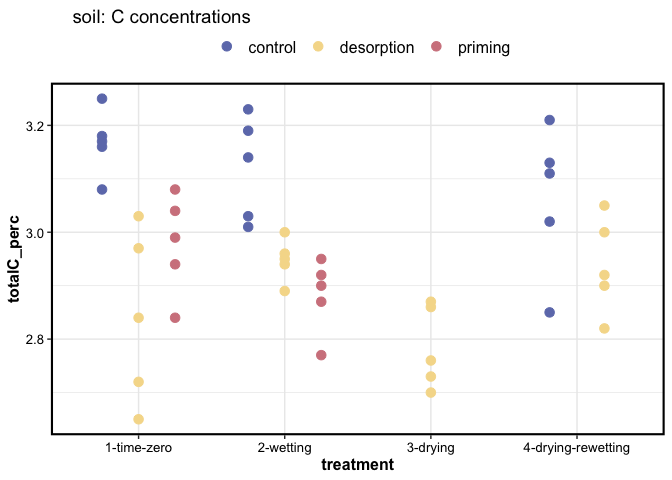
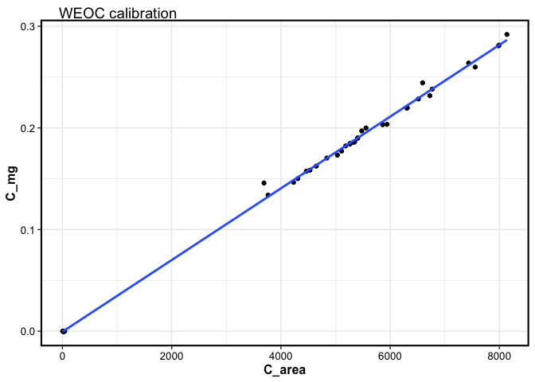
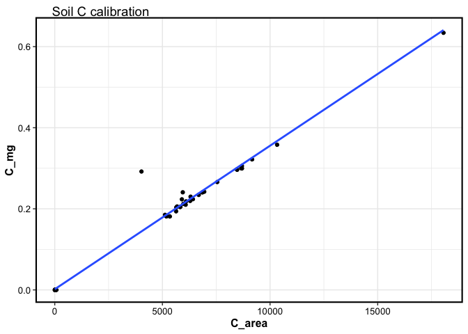

IRMS results
================

-----

## Water extractable organic carbon (WEOC)

    #> $gg_weoc_d13C

<!-- -->

    #> 
    #> $gg_weoc_tc

<!-- -->

## Soil total carbon

    #> $gg_soil_d13C

<!-- -->

    #> 
    #> $gg_soil_tc

<!-- -->

-----

## Albus (Total C) calibration

<!-- --><!-- -->

-----

Session Info

Date run: `Sys.Date()`

    #> R version 4.0.2 (2020-06-22)
    #> Platform: x86_64-apple-darwin17.0 (64-bit)
    #> Running under: macOS Catalina 10.15.7
    #> 
    #> Matrix products: default
    #> BLAS:   /System/Library/Frameworks/Accelerate.framework/Versions/A/Frameworks/vecLib.framework/Versions/A/libBLAS.dylib
    #> LAPACK: /Library/Frameworks/R.framework/Versions/4.0/Resources/lib/libRlapack.dylib
    #> 
    #> locale:
    #> [1] en_US.UTF-8/en_US.UTF-8/en_US.UTF-8/C/en_US.UTF-8/en_US.UTF-8
    #> 
    #> attached base packages:
    #> [1] stats     graphics  grDevices utils     datasets  methods   base     
    #> 
    #> other attached packages:
    #>  [1] PNWColors_0.1.0 drake_7.12.4    forcats_0.5.0   stringr_1.4.0   dplyr_1.0.1    
    #>  [6] purrr_0.3.4     readr_1.3.1     tidyr_1.1.1     tibble_3.0.3    ggplot2_3.3.2  
    #> [11] tidyverse_1.3.0
    #> 
    #> loaded via a namespace (and not attached):
    #>  [1] Rcpp_1.0.5        lattice_0.20-41   lubridate_1.7.9   txtq_0.2.3        prettyunits_1.1.1
    #>  [6] assertthat_0.2.1  digest_0.6.25     packrat_0.5.0     R6_2.4.1          cellranger_1.1.0 
    #> [11] backports_1.1.8   reprex_0.3.0      evaluate_0.14     httr_1.4.2        pillar_1.4.6     
    #> [16] rlang_0.4.7       progress_1.2.2    readxl_1.3.1      rstudioapi_0.11   blob_1.2.1       
    #> [21] R.oo_1.23.0       R.utils_2.9.2     Matrix_1.2-18     rmarkdown_2.3     splines_4.0.2    
    #> [26] labeling_0.3      igraph_1.2.5      munsell_0.5.0     tinytex_0.25      broom_0.7.0      
    #> [31] compiler_4.0.2    modelr_0.1.8      xfun_0.16         pkgconfig_2.0.3   mgcv_1.8-31      
    #> [36] htmltools_0.5.0   tidyselect_1.1.0  fansi_0.4.1       crayon_1.3.4      dbplyr_1.4.4     
    #> [41] withr_2.2.0       R.methodsS3_1.8.0 grid_4.0.2        nlme_3.1-148      jsonlite_1.7.0   
    #> [46] gtable_0.3.0      lifecycle_0.2.0   DBI_1.1.0         magrittr_1.5      storr_1.2.1      
    #> [51] scales_1.1.1      cli_2.0.2         stringi_1.4.6     farver_2.0.3      fs_1.5.0         
    #> [56] xml2_1.3.2        ellipsis_0.3.1    filelock_1.0.2    generics_0.0.2    vctrs_0.3.2      
    #> [61] tools_4.0.2       glue_1.4.1        markdown_1.1      hms_0.5.3         parallel_4.0.2   
    #> [66] yaml_2.2.1        colorspace_1.4-1  base64url_1.4     rvest_0.3.6       knitr_1.29       
    #> [71] ezknitr_0.6       haven_2.3.1

