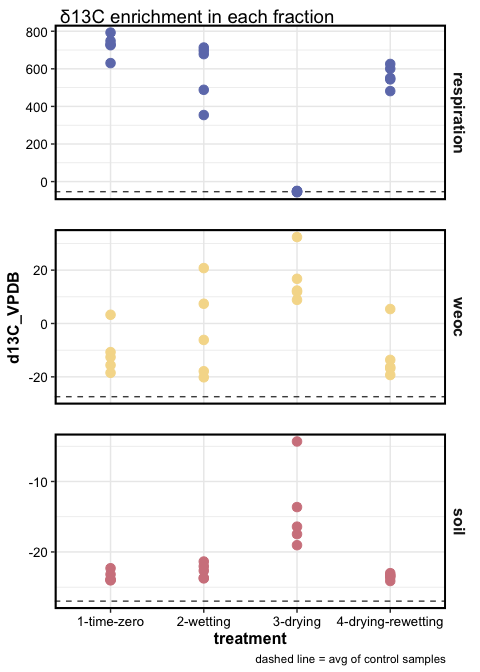
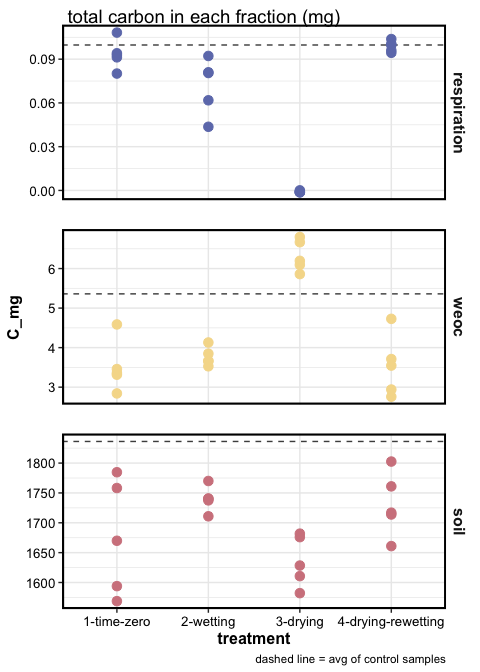
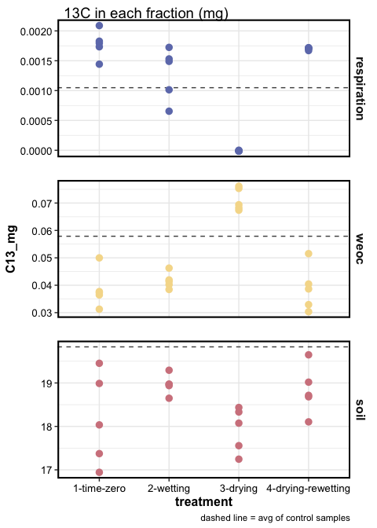
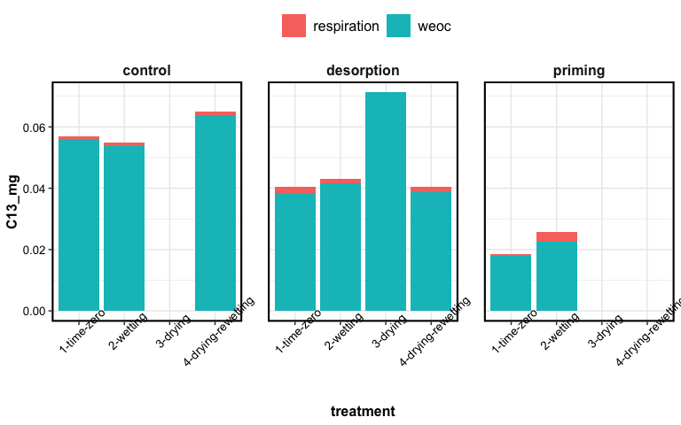

SOM destabilization
================

<details>

<summary>experimental info, click here</summary> two treatments:

1.  desorption: 13C oxalic acid adsorbed to goethite, 5 g goethite+OA
    added to soil
2.  priming: 13C oxalic acid added to soil as solution, 5 g goethite
    (without substrate) added to soil
3.  control: 5 g goethite added to soil, but no OA, only water

Jars were sealed for 48 hours, after which headspace samples were
collected and analyzed for CO2 concentration and 13C/12C composition of
CO2.

-----

How much substrate was added?

``` r
substrate = "OXALIC ACID"
A_labelled = 0.99
A_unlabelled = 0.0121 

mole_substrate = (12*2) + (1*2) + (16*4) # molar weight of substrate
mole_carbon = 12* 2 # molar weight of carbon in substrate
carbon_atoms = 2
c_fraction = mole_carbon/mole_substrate
```

279.384 mg unlabelled oxalic acid (enrichment = 0.0121) was mixed with
58.700 mg labelled oxalic acid (enrichment = 0.99) in 600 mL deionized
water.

``` r
M_labelled = 58.700 # mg
M_unlabelled = 279.384 # mg

# A_mixture * (M_labelled + M_unlabelled) = (A_unlabelled * M_unlabelled) + (A_labelled + M_labelled)
A_mixture = ((A_unlabelled * M_unlabelled) + (A_labelled + M_labelled)) / (M_labelled + M_unlabelled)
print(A_mixture)
#> [1] 0.1865529
```

|                        | value      |
| ---------------------- | ---------- |
| total enrichment       | 0.1866     |
| total volume (mL)      | 600        |
| total oxalic acid (mg) | 338.084    |
| total C (mg)           | 90.1557333 |

**desorption**

20 mL of this solution was added to 5 g goethite.

**priming**

16 mL of this solution was added to the soil + 5 g goethite.

|                        | value per 16 mL |
| ---------------------- | --------------- |
| total enrichment       | 0.1866          |
| total volume (mL)      | 16              |
| total oxalic acid (mg) | 9.0155733       |
| total C (mg)           | 2.4041529       |
| 13C (mg)               | 0.4174222       |

</details>

-----

<details>

<summary>overall, preliminary plots</summary>

### Respiration

<!-- --><!-- --><!-- -->

### Soil and WEOC

<!-- --><!-- --><!-- -->

</details>

-----

## DESORPTION SAMPLES

<!-- --><!-- --><!-- -->

### mass balance

<!-- -->

## PRIMING SAMPLES

<!-- -->

-----

<details>

<summary>Session Info</summary>

**Kaizad F. Patel**

Date Run: 2021-01-07

    #> R version 4.0.2 (2020-06-22)
    #> Platform: x86_64-apple-darwin17.0 (64-bit)
    #> Running under: macOS Catalina 10.15.7
    #> 
    #> Matrix products: default
    #> BLAS:   /Library/Frameworks/R.framework/Versions/4.0/Resources/lib/libRblas.dylib
    #> LAPACK: /Library/Frameworks/R.framework/Versions/4.0/Resources/lib/libRlapack.dylib
    #> 
    #> locale:
    #> [1] en_US.UTF-8/en_US.UTF-8/en_US.UTF-8/C/en_US.UTF-8/en_US.UTF-8
    #> 
    #> attached base packages:
    #> [1] stats     graphics  grDevices utils     datasets  methods   base     
    #> 
    #> other attached packages:
    #>  [1] PNWColors_0.1.0 forcats_0.5.0   stringr_1.4.0   dplyr_1.0.1    
    #>  [5] purrr_0.3.4     readr_1.3.1     tidyr_1.1.1     tibble_3.0.3   
    #>  [9] ggplot2_3.3.2   tidyverse_1.3.0 drake_7.12.4   
    #> 
    #> loaded via a namespace (and not attached):
    #>  [1] Rcpp_1.0.5        lubridate_1.7.9   txtq_0.2.3        prettyunits_1.1.1
    #>  [5] assertthat_0.2.1  digest_0.6.25     R6_2.4.1          cellranger_1.1.0 
    #>  [9] backports_1.1.8   reprex_0.3.0      evaluate_0.14     httr_1.4.2       
    #> [13] pillar_1.4.6      rlang_0.4.7       progress_1.2.2    readxl_1.3.1     
    #> [17] rstudioapi_0.11   blob_1.2.1        rmarkdown_2.3     labeling_0.3     
    #> [21] igraph_1.2.5      munsell_0.5.0     broom_0.7.0       compiler_4.0.2   
    #> [25] modelr_0.1.8      xfun_0.16         pkgconfig_2.0.3   htmltools_0.5.0  
    #> [29] tidyselect_1.1.0  fansi_0.4.1       crayon_1.3.4      dbplyr_1.4.4     
    #> [33] withr_2.2.0       grid_4.0.2        jsonlite_1.7.0    gtable_0.3.0     
    #> [37] lifecycle_0.2.0   DBI_1.1.0         magrittr_1.5      storr_1.2.1      
    #> [41] scales_1.1.1      cli_2.0.2         stringi_1.4.6     farver_2.0.3     
    #> [45] fs_1.5.0          xml2_1.3.2        ellipsis_0.3.1    filelock_1.0.2   
    #> [49] generics_0.0.2    vctrs_0.3.2       tools_4.0.2       glue_1.4.1       
    #> [53] hms_0.5.3         parallel_4.0.2    yaml_2.2.1        colorspace_1.4-1 
    #> [57] base64url_1.4     rvest_0.3.6       knitr_1.29        haven_2.3.1

</details>

-----
