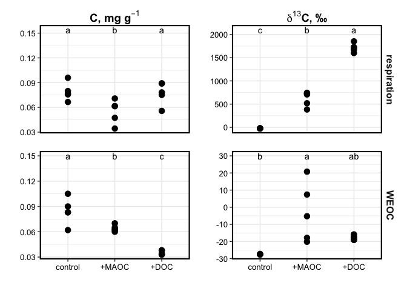

## HYPOTHESES

------------------------------------------------------------------------

------------------------------------------------------------------------

<!-- -->

| treatment | type       | fraction     | C13\_ug\_g\_mean |   se |
|:----------|:-----------|:-------------|-----------------:|-----:|
| 2-wetting | control    | respiration  |             0.86 | 0.05 |
| 2-wetting | control    | weoc         |             0.91 | 0.07 |
| 2-wetting | control    | weoc\_pellet |           293.33 | 1.95 |
| 2-wetting | control    | total        |           295.10 | 2.04 |
| 2-wetting | sorbed-C   | respiration  |             1.00 | 0.15 |
| 2-wetting | sorbed-C   | weoc         |             0.71 | 0.02 |
| 2-wetting | sorbed-C   | weoc\_pellet |           286.82 | 4.36 |
| 2-wetting | sorbed-C   | total        |           288.53 | 4.30 |
| 2-wetting | solution-C | respiration  |             2.29 | 0.17 |
| 2-wetting | solution-C | weoc         |             0.38 | 0.01 |
| 2-wetting | solution-C | weoc\_pellet |           272.59 | 3.83 |
| 2-wetting | solution-C | total        |           275.26 | 3.94 |
