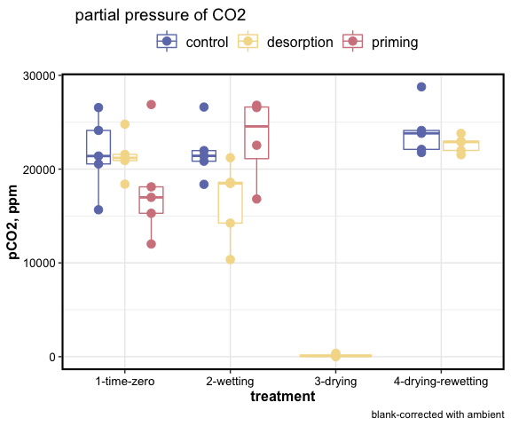
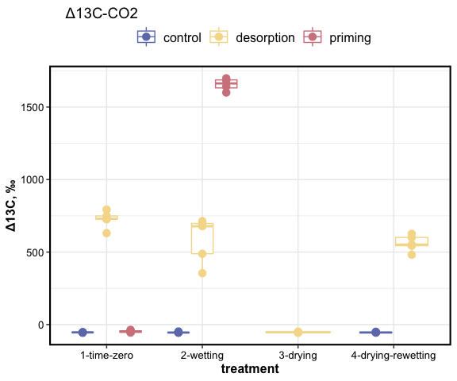
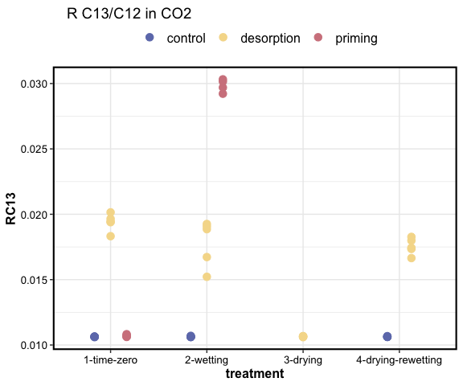
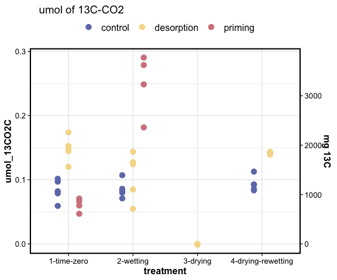

DOM destabilization: respiration
================

two treatments:

1.  desorption: 13C oxalic acid adsorbed to goethite, 5 g goethite+OA
    added to soil
2.  priming: 13C oxalic acid added to soil as solution, 5 g goethite
    (without substrate) added to soil
3.  control: 5 g goethite added to soil, but no OA, only water

Jars were sealed for 48 hours, after which headspace samples were
collected and analyzed for CO2 concentration and 13C/12C composition of
CO2.

-----

<!-- --><!-- --><!-- --><!-- -->

-----

### priming

How much priming was seen in the treatments?

Priming calculated as: *(CO2C\_umol - 13CO2C\_umol) -
control\_CO2C\_umol*

[from Bastida et al. Nat.
Comms.](https://doi.org/10.1038/s41467-019-11472-7)

| treatment          | desorption\_umolC | priming\_umolC |
| :----------------- | ----------------: | -------------: |
| 1-time-zero        |           \-1.968 |        \-7.597 |
| 2-wetting          |          \-13.136 |          1.029 |
| 4-drying-rewetting |           \-5.000 |             NA |

-----

Session Info

Date Run: 2020-12-28

    #> R version 4.0.2 (2020-06-22)
    #> Platform: x86_64-apple-darwin17.0 (64-bit)
    #> Running under: macOS Catalina 10.15.7
    #> 
    #> Matrix products: default
    #> BLAS:   /System/Library/Frameworks/Accelerate.framework/Versions/A/Frameworks/vecLib.framework/Versions/A/libBLAS.dylib
    #> LAPACK: /Library/Frameworks/R.framework/Versions/4.0/Resources/lib/libRlapack.dylib
    #> 
    #> locale:
    #> [1] en_US.UTF-8/en_US.UTF-8/en_US.UTF-8/C/en_US.UTF-8/en_US.UTF-8
    #> 
    #> attached base packages:
    #> [1] stats     graphics  grDevices
    #> [4] utils     datasets  methods  
    #> [7] base     
    #> 
    #> other attached packages:
    #>  [1] PNWColors_0.1.0 drake_7.12.4   
    #>  [3] forcats_0.5.0   stringr_1.4.0  
    #>  [5] dplyr_1.0.1     purrr_0.3.4    
    #>  [7] readr_1.3.1     tidyr_1.1.1    
    #>  [9] tibble_3.0.3    ggplot2_3.3.2  
    #> [11] tidyverse_1.3.0
    #> 
    #> loaded via a namespace (and not attached):
    #>  [1] Rcpp_1.0.5       
    #>  [2] lubridate_1.7.9  
    #>  [3] txtq_0.2.3       
    #>  [4] prettyunits_1.1.1
    #>  [5] assertthat_0.2.1 
    #>  [6] digest_0.6.25    
    #>  [7] packrat_0.5.0    
    #>  [8] R6_2.4.1         
    #>  [9] cellranger_1.1.0 
    #> [10] backports_1.1.8  
    #> [11] reprex_0.3.0     
    #> [12] evaluate_0.14    
    #> [13] highr_0.8        
    #> [14] httr_1.4.2       
    #> [15] pillar_1.4.6     
    #> [16] rlang_0.4.7      
    #> [17] progress_1.2.2   
    #> [18] readxl_1.3.1     
    #> [19] rstudioapi_0.11  
    #> [20] blob_1.2.1       
    #> [21] rmarkdown_2.3    
    #> [22] labeling_0.3     
    #> [23] igraph_1.2.5     
    #> [24] munsell_0.5.0    
    #> [25] tinytex_0.25     
    #> [26] broom_0.7.0      
    #> [27] compiler_4.0.2   
    #> [28] modelr_0.1.8     
    #> [29] xfun_0.16        
    #> [30] pkgconfig_2.0.3  
    #> [31] htmltools_0.5.0  
    #> [32] tidyselect_1.1.0 
    #> [33] fansi_0.4.1      
    #> [34] crayon_1.3.4     
    #> [35] dbplyr_1.4.4     
    #> [36] withr_2.2.0      
    #> [37] grid_4.0.2       
    #> [38] jsonlite_1.7.0   
    #> [39] gtable_0.3.0     
    #> [40] lifecycle_0.2.0  
    #> [41] DBI_1.1.0        
    #> [42] magrittr_1.5     
    #> [43] storr_1.2.1      
    #> [44] scales_1.1.1     
    #> [45] cli_2.0.2        
    #> [46] stringi_1.4.6    
    #> [47] farver_2.0.3     
    #> [48] fs_1.5.0         
    #> [49] xml2_1.3.2       
    #> [50] ellipsis_0.3.1   
    #> [51] filelock_1.0.2   
    #> [52] generics_0.0.2   
    #> [53] vctrs_0.3.2      
    #> [54] tools_4.0.2      
    #> [55] glue_1.4.1       
    #> [56] hms_0.5.3        
    #> [57] parallel_4.0.2   
    #> [58] yaml_2.2.1       
    #> [59] colorspace_1.4-1 
    #> [60] base64url_1.4    
    #> [61] rvest_0.3.6      
    #> [62] knitr_1.29       
    #> [63] haven_2.3.1

