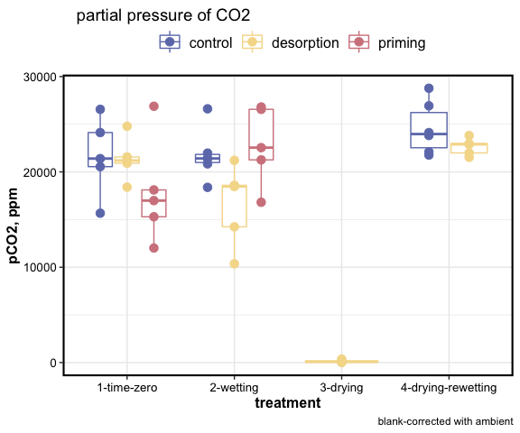
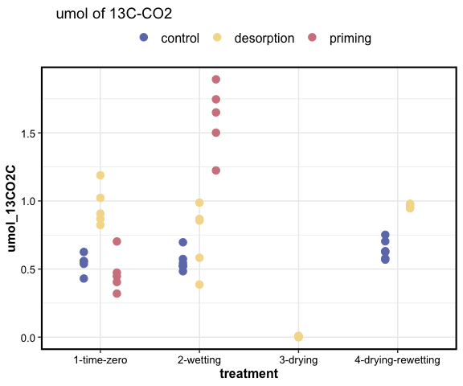

DOM destabilization: respiration
================

two treatments:

1.  desorption: 13C oxalic acid adsorbed to goethite, 5 g goethite+OA
    added to soil
2.  priming: 13C oxalic acid added to soil as solution, 5 g goethite
    (without substrate) added to soil
3.  control: 5 g goethite added to soil, but no OA, only water

Jars were sealed for 48 hours, after which headspace samples were
collected and analyzed for CO2 concentration and 13C/12C composition of
CO2.

-----

<!-- --><!-- --><!-- --><!-- -->

-----

### priming

How much priming was seen in the treatments?

Priming calculated as: *(CO2C\_umol - 13CO2C\_umol) -
control\_CO2C\_umol*

[from Bastida et al. Nat.
Comms.](https://doi.org/10.1038/s41467-019-11472-7)

| treatment          | desorption\_umolC | priming\_umolC |
| :----------------- | ----------------: | -------------: |
| 1-time-zero        |           \-1.968 |        \-7.597 |
| 2-wetting          |          \-12.481 |          1.029 |
| 4-drying-rewetting |           \-6.167 |             NA |

-----

Session Info

Date Run: 2020-09-24

    #> R version 4.0.2 (2020-06-22)
    #> Platform: x86_64-apple-darwin17.0 (64-bit)
    #> Running under: macOS Catalina 10.15.6
    #> 
    #> Matrix products: default
    #> BLAS:   /System/Library/Frameworks/Accelerate.framework/Versions/A/Frameworks/vecLib.framework/Versions/A/libBLAS.dylib
    #> LAPACK: /Library/Frameworks/R.framework/Versions/4.0/Resources/lib/libRlapack.dylib
    #> 
    #> locale:
    #> [1] en_US.UTF-8/en_US.UTF-8/en_US.UTF-8/C/en_US.UTF-8/en_US.UTF-8
    #> 
    #> attached base packages:
    #> [1] stats     graphics  grDevices utils     datasets 
    #> [6] methods   base     
    #> 
    #> other attached packages:
    #>  [1] PNWColors_0.1.0 drake_7.12.4    forcats_0.5.0  
    #>  [4] stringr_1.4.0   dplyr_1.0.1     purrr_0.3.4    
    #>  [7] readr_1.3.1     tidyr_1.1.1     tibble_3.0.3   
    #> [10] ggplot2_3.3.2   tidyverse_1.3.0
    #> 
    #> loaded via a namespace (and not attached):
    #>  [1] Rcpp_1.0.5        lubridate_1.7.9   txtq_0.2.3       
    #>  [4] prettyunits_1.1.1 assertthat_0.2.1  digest_0.6.25    
    #>  [7] packrat_0.5.0     R6_2.4.1          cellranger_1.1.0 
    #> [10] backports_1.1.8   reprex_0.3.0      evaluate_0.14    
    #> [13] httr_1.4.2        highr_0.8         pillar_1.4.6     
    #> [16] rlang_0.4.7       progress_1.2.2    readxl_1.3.1     
    #> [19] rstudioapi_0.11   blob_1.2.1        rmarkdown_2.3    
    #> [22] labeling_0.3      igraph_1.2.5      munsell_0.5.0    
    #> [25] broom_0.7.0       compiler_4.0.2    modelr_0.1.8     
    #> [28] xfun_0.16         pkgconfig_2.0.3   htmltools_0.5.0  
    #> [31] tidyselect_1.1.0  fansi_0.4.1       crayon_1.3.4     
    #> [34] dbplyr_1.4.4      withr_2.2.0       grid_4.0.2       
    #> [37] jsonlite_1.7.0    gtable_0.3.0      lifecycle_0.2.0  
    #> [40] DBI_1.1.0         magrittr_1.5      storr_1.2.1      
    #> [43] scales_1.1.1      cli_2.0.2         stringi_1.4.6    
    #> [46] farver_2.0.3      fs_1.5.0          xml2_1.3.2       
    #> [49] ellipsis_0.3.1    filelock_1.0.2    generics_0.0.2   
    #> [52] vctrs_0.3.2       tools_4.0.2       glue_1.4.1       
    #> [55] hms_0.5.3         parallel_4.0.2    yaml_2.2.1       
    #> [58] colorspace_1.4-1  base64url_1.4     rvest_0.3.6      
    #> [61] knitr_1.29        haven_2.3.1

