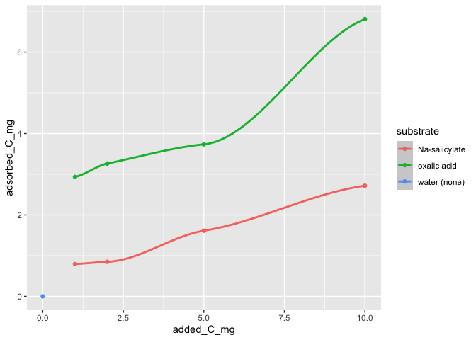

adsorption tests
================
Kaizad F. Patel

**Testing adsorption of organic substrate on clay minerals.**

Test 2: March 3

clay = goethite  
substrates = sodium salicylate, oxalic acid

-----

### Procedure

1.  Prepare 1000 ppm C solution salicylate. Prepare 500 ppm C solution
    oxalic acid
2.  Weigh 5 g goethite
3.  Add 1 mL, 2 mL, 5 mL, 10 mL substrate
4.  Make up volume to 20 mL
5.  Shake overnight. 250 rpm in 2H (room temperature)
6.  freeze-dry in 2226.
7.  analyze for TC on VarioMAX Cube.

Test adsorption by adding an equivalent of 0, 1, 2, 5, 10 mg C to the
clay.

-----

<!-- -->

we want \~ 3 mg C adsorbed per 50-g core of soil.  
so for OXALIC ACID, we add 5 mg C (round up to 6 mg C) to 5 g clay and
\~3.8 mg C is adsorbed.  
for SODIUM SALICYLATE, we add 12 mg C to 5 g clay and \~ 4 mg C is
adsorbed (extrapolating).

*see separate file for isotope calculations*  
OXALIC ACID:  
we want 1 mg labelled C + 5 mg unlabelled C  
\= 3.75 mg labelled OA + 18.75 mg unlabelled OA per soil core

SALICYLIC ACID: we want 2 mg labelled C + 10 mg unlabelled C  
\= 3.28 mg labelled SA + 16.42 mg unlabelled SA

for 100 samples, we need  
OA, labelled: 375 mg  
OA, unlabelled: 1875 mg  
SA, labelled: 328 mg  
SA, unlabelled: 1642 mg

-----

**Session Info:**

last run: 2020-06-18

    #> R version 3.6.0 (2019-04-26)
    #> Platform: x86_64-apple-darwin15.6.0 (64-bit)
    #> Running under: macOS Mojave 10.14.6
    #> 
    #> Matrix products: default
    #> BLAS:   /Library/Frameworks/R.framework/Versions/3.6/Resources/lib/libRblas.0.dylib
    #> LAPACK: /Library/Frameworks/R.framework/Versions/3.6/Resources/lib/libRlapack.dylib
    #> 
    #> locale:
    #> [1] en_US.UTF-8/en_US.UTF-8/en_US.UTF-8/C/en_US.UTF-8/en_US.UTF-8
    #> 
    #> attached base packages:
    #> [1] stats     graphics  grDevices utils     datasets  methods   base     
    #> 
    #> other attached packages:
    #>  [1] forcats_0.5.0   stringr_1.4.0   dplyr_1.0.0     purrr_0.3.4    
    #>  [5] tibble_3.0.1    ggplot2_3.3.0   tidyverse_1.3.0 tidyr_1.1.0    
    #>  [9] readxl_1.3.1    readr_1.3.1    
    #> 
    #> loaded via a namespace (and not attached):
    #>  [1] tidyselect_1.1.0 xfun_0.10        splines_3.6.0    haven_2.2.0     
    #>  [5] lattice_0.20-38  colorspace_1.4-1 vctrs_0.3.0      generics_0.0.2  
    #>  [9] htmltools_0.4.0  yaml_2.2.0       mgcv_1.8-29      blob_1.2.1      
    #> [13] rlang_0.4.6      pillar_1.4.4     glue_1.4.0       withr_2.1.2     
    #> [17] DBI_1.0.0        dbplyr_1.4.4     modelr_0.1.5     lifecycle_0.2.0 
    #> [21] munsell_0.5.0    gtable_0.3.0     cellranger_1.1.0 rvest_0.3.5     
    #> [25] evaluate_0.14    labeling_0.3     knitr_1.25       fansi_0.4.0     
    #> [29] broom_0.5.6      Rcpp_1.0.2       backports_1.1.5  scales_1.0.0    
    #> [33] jsonlite_1.6.1   fs_1.3.1         hms_0.5.3        digest_0.6.25   
    #> [37] stringi_1.4.3    grid_3.6.0       cli_2.0.2        tools_3.6.0     
    #> [41] magrittr_1.5     crayon_1.3.4     pkgconfig_2.0.3  Matrix_1.2-18   
    #> [45] ellipsis_0.3.0   xml2_1.2.2       reprex_0.3.0     lubridate_1.7.8 
    #> [49] assertthat_0.2.1 rmarkdown_2.1    httr_1.4.1       rstudioapi_0.11 
    #> [53] R6_2.4.0         nlme_3.1-141     compiler_3.6.0
